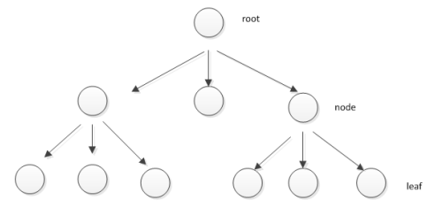

传统方案解决学校院系展示存在的问题分析
1) 将学院看做是学校的子类，系是学院的子类，这样实际上是站在组织大小来进行分
   层次的
2) 实际上我们的要求是 ：在一个页面中展示出学校的院系组成，一个学校有多个
   学院，一个学院有多个系， 因此这种方案，不能很好实现的管理的操作，比如
   对学院、系的添加，删除，遍历等
3) 解决方案：把学校、院、系都看做是组织结构，他们之间没有继承的关系，而是
   一个树形结构，可以更好的实现管理操作。 => 组合模式

基本介绍
1) 组合模式（Composite Pattern），又叫部分整体模式，它创建了对象组的树形结
   构，将对象组合成树状结构以表示“整体-部分”的层次关系。
2) 组合模式依据树形结构来组合对象，用来表示部分以及整体层次。
3) 这种类型的设计模式属于结构型模式。
4) 组合模式使得用户对单个对象和组合对象的访问具有一致性，即：组合能让客
   户以一致的方式处理个别对象以及组合对象

对原理结构图的说明-即(组合模式的角色及职责)
1) Component :这是组合中对象声明接口，在适当情况下，实现所有类共有的接口默认行为,用于访问和管理Component 子
   部件, Component 可以是抽象类或者接口
2) Leaf : 在组合中表示叶子节点，叶子节点没有子节点

解决的问题
1) 组合模式解决这样的问题，当我们的要处理的对象可以生成一颗树形结构，而
   我们要对树上的节点和叶子进行操作时，它能够提供一致的方式，而不用考虑
   它是节点还是叶子
2) 对应的示意图
   

组合模式解决学校院系展示的 应用实例
1) 应用实例要求
   编写程序展示一个学校院系结构：需求是这样，要在一个页面中展示出学校的院系组
   成，一个学校有多个学院，一个学院有多个系。

# 组合模式的注意事项和细节
1) 简化客户端操作。客户端只需要面对一致的对象而不用考虑整体部分或者节点叶子
   的问题。
2) 具有较强的扩展性。当我们要更改组合对象时，我们只需要调整内部的层次关系，
   客户端不用做出任何改动.
3) 方便创建出复杂的层次结构。客户端不用理会组合里面的组成细节，容易添加节点
   或者叶子从而创建出复杂的树形结构
4) 需要遍历组织机构，或者处理的对象具有树形结构时, 非常适合使用组合模式.
5) 要求较高的抽象性，如果节点和叶子有很多差异性的话，比如很多方法和属性
   都不一样，不适合使用组合模式