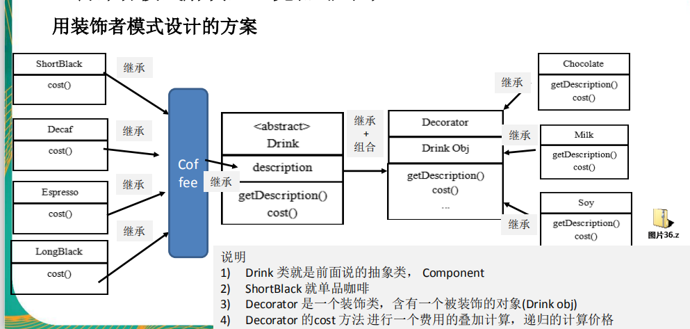

星巴克咖啡订单项目（咖啡馆）：
1) 咖啡种类/单品咖啡：Espresso(意大利浓咖啡)、ShortBlack、LongBlack(美式
   咖啡)、Decaf(无因咖啡)
2) 调料：Milk、Soy(豆浆)、Chocolate
3) 要求在扩展新的咖啡种类时，具有良好的扩展性、改动方便、维护方便
4) 使用OO的来计算不同种类咖啡的费用: 客户可以点单品咖啡，也可以单品咖
   啡+调料组合。

装饰者模式定义
1) 装饰者模式：动态的将新功能附加到对象上。在对象功能扩展方面，它比继承更
   有弹性，装饰者模式也体现了开闭原则(ocp)
2) 这里提到的动态的将新功能附加到对象和ocp原则，在后面的应用实例上会以代
   码的形式体现，请同学们注意体会。
   
装饰者模式原理
1) 装饰者模式就像打包一个快递  主体：比如：陶瓷、衣服 (Component) // 被装饰者
    包装：比如：报纸填充、塑料泡沫、纸板、木板(Decorator)
2) Component
   主体：比如类似前面的Drink
3) ConcreteComponent和Decorator
   ConcreteComponent：具体的主体，
   比如前面的各个单品咖啡
   Decorator: 装饰者，比如各调料.
4) 在如图的Component与ConcreteComponent之间，如果
   ConcreteComponent类很多,还可以设计一个缓冲层，将共有的部分提取出来，
   抽象层一个类。
   

装饰者模式下的订单：2份巧克力+一份牛奶的LongBlack
说明
1) Milk包含了LongBlack
2) 一份Chocolate包含了(Milk+LongBlack)
3) 一份Chocolate包含了(Chocolate+Milk+LongBlack)
4) 这样不管是什么形式的单品咖啡+调料组合，通过递归方式可以方便的组合和维护。